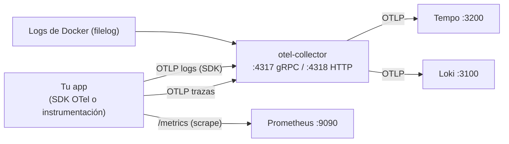

# OpenTelemetry — Conceptos, configuración y lo automático vs manual

Guía complementaria a [`README.md`](README.md). Explica desde lo básico de observabilidad hasta qué partes de tu stack se configuran solas y cuáles necesitan código tuyo.

---

## 1. Los tres pilares de la observabilidad

| Pilar | Pregunta que responde | Qué contiene | Dónde se ve |
|-------|----------------------|--------------|-------------|
| **Métricas** | ¿Cuánto, con qué frecuencia, en cuánto tiempo? | números agregados (requests/seg, latencia, % de error, CPU) | Prometheus / Grafana |
| **Logs** | ¿Qué pasó exactamente? | eventos discretos con detalle (errores, warnings, contexto) | Loki |
| **Trazas** | ¿Cómo fluyó una sola operación de punta a punta? | árbol de spans de una request | Tempo |

No son lo mismo ni se reemplazan:

- Una **métrica** te dice que algo subió, pero no qué request falló.
- Un **log** te da el detalle de un caso, pero no el contexto de la operación completa.
- Una **traza** te muestra el viaje completo de una operación a través de todos los servicios, librerías y colas.

Se **correlacionan** entre sí:

- Un log de una operación trazada debe llevar `trace_id` / `span_id` para saltar de un log a su traza en Grafana.
- Las trazas pueden **derivar métricas** (span metrics / métricas RED: Rate, Errors, Duration).
- Con LogQL de Loki puedes **calcular métricas a partir de logs** (p. ej. contar errores por minuto).

### Los logs NO tienen métricas

Es un malentendido común. El log no "contiene" métricas: es otro pilar. Lo que ocurre es que **se derivan métricas de los otros pilares** (span metrics desde trazas, métricas desde logs), pero son tipos de dato independientes.

---

## 2. El modelo de datos de OpenTelemetry

### Trazas

Una **traza** es un árbol de spans con un identificador común:

```
trace_id (16 bytes, hex)  → agrupa todos los spans de la operación

Span individual:
├── trace_id
├── span_id (8 bytes, hex)
├── parent_span_id        ← quién lo llamó (vacío en el span raíz)
├── name                  ← "GET /orders"
├── kind                  ← SERVER / CLIENT / PRODUCER / CONSUMER / INTERNAL
├── start_time / end_time → duración
├── attributes            ← key/value: http.method, http.status_code, db.system…
├── status                ← OK / ERROR (+ description)
├── events                ← p. ej. la excepción que lanzó
└── resource              ← service.name, service.version, host…
```

Un span de un microservicio es **hijo** de un span de otro cuando su `parent_span_id` apunta al `span_id` del padre. Así se reconstruye el viaje completo en Tempo.

### Métricas

| Tipo | Para qué | Ejemplo |
|------|----------|---------|
| Counter | valores que solo aumentan | `http_requests_total` |
| UpDownCounter | valores que suben y bajan | `workers_activos` |
| Histogram | distribuciones de valores | latencia, tamaño de payload |
| Gauge | valor puntual observable | CPU, memoria |

### Logs (OTLP)

Un log OTLP tiene: **body** (el mensaje), **timestamp**, **severity** (nivel), **attributes** y **resource**. Si pertenece a una operación trazada, lleva `trace_id` y `span_id` como atributos.

---

## 3. Cómo fluyen los datos en tu stack



Puntos de entrada que ya tienes configurados (`otel-collector/config.yaml`):

| Señal | Entrada | Cómo llega |
|-------|---------|------------|
| Trazas | `otlp` gRPC `:4317` / HTTP `:4318` | tu app con SDK OTel → collector → **Tempo** |
| Logs de tu app | `otlp` `:4317`/`:4318` | tu app con SDK OTel (logs) → collector → **Loki** |
| Logs de contenedores | receiver `filelog/docker` | el collector lee `/var/lib/docker/containers/*/*-json.log` directamente (sin tocar tu app) |
| Logs del sistema | receiver `filelog/system` | el collector lee `/var/log/*.log` |
| Métricas | scrape `:9090` | tu app expone `/metrics` y Prometheus hace *scrape* |

Solo tienes que estar en la red `monitoring` de Docker. Los logs a stdout de tu contenedor ya se recolectan con el `filelog` **sin instrumentar nada**.

> Trazas **siempre** van por OTel (SDK → OTLP). Los logs pueden ir por `filelog` (sin código) o por OTLP (con SDK). Las métricas de app van por `/metrics` (scrape) o por OTLP si ya usas el SDK de métricas.

---

## 4. Automático vs manual

Regla mental: **la instrumentación automática cubre el "tráfico" (HTTP, gRPC, DB, colas, runtime). Lo tuyo de negocio siempre es manual.**

| Qué | ¿Automático? | ¿Manual? | Notas |
|-----|:---:|:---:|-------|
| Spans de HTTP entrante (controlador/endpoint) | ✅ | | lo crea la auto-instrumentación |
| Spans de llamadas salientes HTTP / gRPC / Redis / DB | ✅ | | el cliente inyecta el contexto |
| Spans de tu lógica de negocio ("procesar-pago") | | ✅ | `@WithSpan`, `tracer.Start` |
| Propagación del contexto dentro del proceso | ✅ | | async-local / thread-local |
| Propagación entre servicios (header `traceparent`) | ✅ | | solo si ambos lados están instrumentados |
| Captura de excepciones en spans | ✅ | | status ERROR automático |
| Métricas de framework/runtime (`http.server.duration`, JVM/Node/Go runtime) | ✅ | | gratis con auto-instrumentación |
| Métricas de negocio (`pedidos_creados_total`) | | ✅ | tú creas el contador y lo registras |
| `trace_id` en tus logs | | ✅ | tu logger debe inyectarlo (el SDK a veces lo expone) |
| Atributos extra en spans | | ✅ | `span.SetAttributes(...)` |

### Lo que NO es código ni manual: la configuración

El grueso de la configuración es **solo variables de entorno**:

| Variable | Función |
|----------|---------|
| `OTEL_SERVICE_NAME` | nombre del servicio en todos los telemetría |
| `OTEL_EXPORTER_OTLP_ENDPOINT` | a dónde mandar (en este stack `http://otel-collector:4318` o `otel-collector:4317`) |
| `OTEL_TRACES_EXPORTER` / `OTEL_METRICS_EXPORTER` / `OTEL_LOGS_EXPORTER` | qué exporters activar |
| `OTEL_TRACES_SAMPLER` | sampleo de trazas (`always_on`, `parentbased_traceidratio`, etc.) |
| `OTEL_RESOURCE_ATTRIBUTES` | atributos extra del resource (`deployment.environment=prod`) |

---

## 5. SDK vs instrumentación: qué aporta el lenguaje y qué aporta OTel

### El SDK de OpenTelemetry (por lenguaje)

Son las **librerías oficiales** (`opentelemetry-sdk` en cada lenguaje). Te dan la API para crear spans/métricas/logs y el "cableado" para exportar por OTLP. Lo que es **propio del lenguaje**: el SDK se integra con el modelo de concurrencia nativo (thread-local en Java, async-local en Python/Go/Node). Tú **no** tienes que propagar el contexto a mano: el SDK lo hace.

Ejemplos en tu repo:

- **Go** (`examples/go/main.go`): configuras el `TracerProvider` + exporter gRPC (`main.go:19-38`) y creas spans manuales con `tracer.Start` (`main.go:43`).
- **Python** (`examples/python/main.py`): configuras `TracerProvider` + `OTLPSpanExporter` (`main.py:8-12`).
- **Java** (`examples/java/spring-boot-code`): con el starter de Spring, solo configuras 2 propiedades (`otel.service.name`, `otel.exporter.otlp.endpoint`) y usas `@WithSpan` (`DemoApplication.java:33`).

### La auto-instrumentación

Son librerías/agentes que **observan los frameworks sin que toques tu código** (o casi): interceptan las librerías HTTP, los ORMs, los drivers de DB, etc., y generan los spans por ti.

| Lenguaje | Auto-instrumentación | Cómo se activa |
|----------|----------------------|----------------|
| Java | agente `opentelemetry-javaagent.jar` | solo `-javaagent` + env vars (`examples/java/spring-boot-agent/run.sh`) |
| Python | `FastAPIInstrumentor`, `opentelemetry-instrumentation-*` | `FastAPIInstrumentor.instrument_app(app)` (`examples/python/main.py:15`) |
| Node.js | `@opentelemetry/auto-instrumentations-node` | se registra en el `sdk-node` (`examples/nestjs/package.json`) |
| Go | instrumentaciones por librería (`net/http`, `grpc-go`, etc.) | envolver el handler / registrar interceptors |

**Regla práctica por lenguaje:**

- **Java** → el agente es la vía normal: 0 código, solo flags y env vars.
- **Python / Node** → un par de líneas al arrancar y las instrumentaciones de las librerías que uses.
- **Go** → no hay agente: eliges instrumentaciones por librería y creas spans manuales en tu lógica.

"Lo que es propio de OTel con el lenguaje" = el **SDK** (API + export). "Instrumentación" = lo que **observa tus librerías**. Con el SDK puedes producir telemetría manual; con la instrumentación obtienes la telemetría "gratis" de tus frameworks.

---

## 6. Microservicios y propagación del contexto

### ¿Cómo se enlazan los traces entre servicios?

El problema: cada servicio es un proceso distinto, el contexto (trace_id + parent) no viaja solo. OTel lo resuelve con **propagación**: el cliente **inyecta** el contexto en la llamada y el servidor lo **extrae**.

- **HTTP**: header `traceparent` (W3C): `traceparent: 00-<trace_id>-<span_id>-01`
- **gRPC**: el contexto viaja en los **metadata** de la llamada (mismo formato, un interceptor lo inyecta).

Si ambos lados están instrumentados con OTel, esto es **automático**: el span del cliente es el *parent* del span del servidor (`parent_span_id` = `span_id` del cliente) y la traza queda continua. No escribes nada.

⚠️ **Si el servicio de destino NO está instrumentado, el trace se rompe**: ese servicio crea una traza nueva sin relación con la tuya. La propagación es tan buena como el eslabón más débil.

### gRPC con OTel

| Qué | Quién lo hace |
|-----|---------------|
| Inyectar `trace_id`/`span_id` en los metadata gRPC de salida | interceptor/estadística de la instrumentación **gRPC** (automático) |
| Extraer el contexto al recibir | interceptor del servidor (automático) |
| Span por RPC (kind CLIENT/SERVER) | la instrumentación (automático) |
| Si quieres spans extra por handler propio | `@WithSpan` / `tracer.Start` (manual) |

Regla: **span del cliente = parent del span del servidor**. El span del servidor siempre es hijo del span del cliente que lo invocó.

---

## 7. Monolito: ¿automático o manual?

Híbrido, con la base **automática**:

- **Entrada HTTP**, llamadas a DB, clientes HTTP/Redis, colas → automático (middlewares/agente de auto-instrumentación).
- **Propagación dentro del proceso** → automática (async-local / thread-local del SDK).
- **Tu lógica de negocio** → manual si quieres verla como span (`@WithSpan` o `tracer.Start`), aunque después la propagación hacia los hijos ya es automática.

En un monolito no hay propagación entre procesos, así que la traza nunca se "rompe" como en microservicios; lo que falta es la granularidad de los spans de negocio si no los creas tú.

---

## 8. Ver el trace desde el frontend

El navegador no consulta Tempo directamente. Dos caminos:

1. **Deep link (recomendado)**: tu API devuelve el `trace_id` de cada operación (header `X-Trace-Id` o en el body). El frontend construye un enlace a Grafana:

   ```
   http://localhost:3001/explore?left={"datasource":"tempo","queries":[{"query":"<trace_id>"}]}
   ```

2. **Instrumentar el navegador (OTel Web)**: el JS del browser genera el `trace_id` y manda `traceparent` en las requests → el trace cruza browser → API → microservicios completo. Requiere que el collector esté expuesto al browser (y CORS) o usar un gateway OTLP.

---

## Resumen rápido

- Los **logs** llevan `trace_id`/`span_id` para correlacionar con su traza; las **métricas** no vienen de los logs, se *derivan* de ellos o de las trazas.
- Lo **automático** cubre tráfico, librerías y runtime; lo **manual** es tu negocio (spans, métricas de negocio, `trace_id` en logs).
- La **configuración** es casi toda por variables de entorno (`OTEL_*`).
- Entre **microservicios** el contexto viaja en `traceparent` (HTTP) o en los metadata de **gRPC**; automático solo si ambos lados están instrumentados.
- **Monolito**: entrada automática, negocio manual.
- Desde el **frontend**: devuelve `X-Trace-Id` y enlaza a Grafana, o instrumenta el browser.
