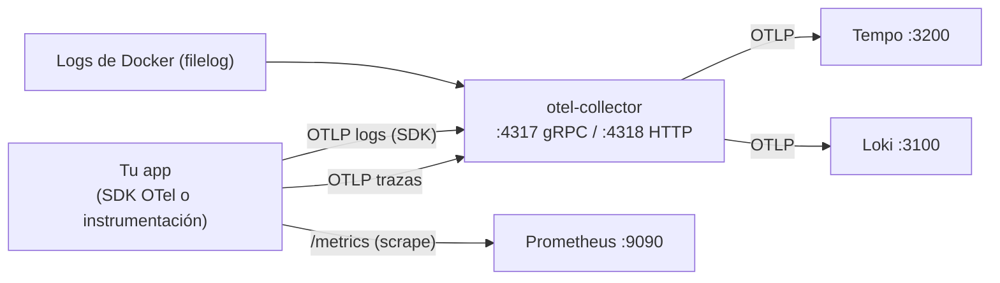
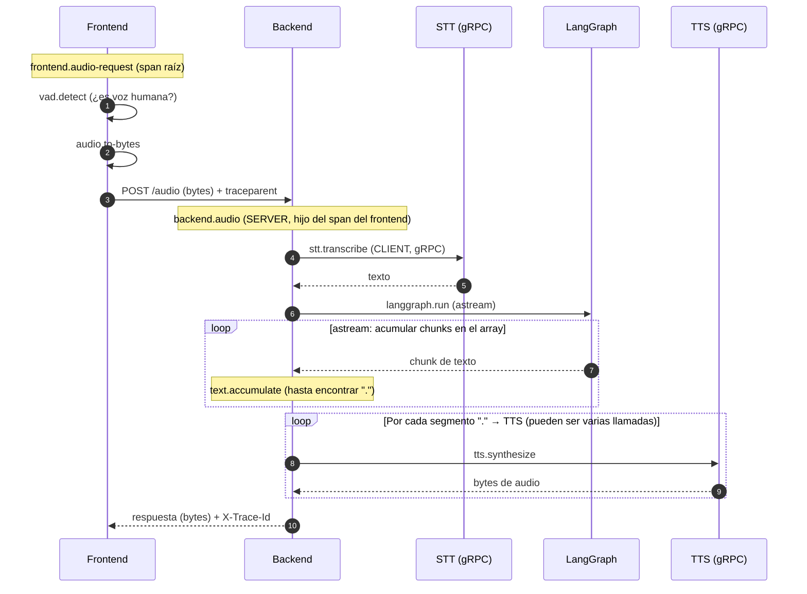
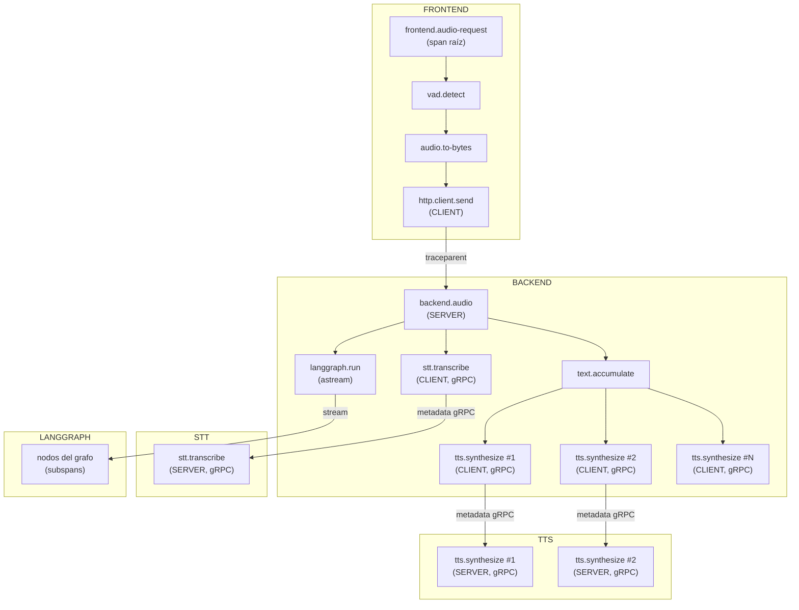

# OpenTelemetry — Conceptos, configuración y lo automático vs manual

Guía complementaria a [`README.md`](README.md). Explica desde lo básico de observabilidad hasta qué partes de tu stack se configuran solas y cuáles necesitan código tuyo.

---

## 1. Los tres pilares de la observabilidad

| Pilar | Pregunta que responde | Qué contiene | Dónde se ve |
|-------|----------------------|--------------|-------------|
| **Métricas** | ¿Cuánto, con qué frecuencia, en cuánto tiempo? | números agregados (requests/seg, latencia, % de error, CPU) | Prometheus / Grafana |
| **Logs** | ¿Qué pasó exactamente? | eventos discretos con detalle (errores, warnings, contexto) | Loki |
| **Trazas** | ¿Cómo fluyó una sola operación de punta a punta? | árbol de spans de una request | Tempo |

No son lo mismo ni se reemplazan:

- Una **métrica** te dice que algo subió, pero no qué request falló.
- Un **log** te da el detalle de un caso, pero no el contexto de la operación completa.
- Una **traza** te muestra el viaje completo de una operación a través de todos los servicios, librerías y colas.

Se **correlacionan** entre sí:

- Un log de una operación trazada debe llevar `trace_id` / `span_id` para saltar de un log a su traza en Grafana.
- Las trazas pueden **derivar métricas** (span metrics / métricas RED: Rate, Errors, Duration).
- Con LogQL de Loki puedes **calcular métricas a partir de logs** (p. ej. contar errores por minuto).

### Los logs NO tienen métricas

Es un malentendido común. El log no "contiene" métricas: es otro pilar. Lo que ocurre es que **se derivan métricas de los otros pilares** (span metrics desde trazas, métricas desde logs), pero son tipos de dato independientes.

---

## 2. El modelo de datos de OpenTelemetry

### Trazas

Una **traza** es un árbol de spans con un identificador común:

```
trace_id (16 bytes, hex)  → agrupa todos los spans de la operación

Span individual:
├── trace_id
├── span_id (8 bytes, hex)
├── parent_span_id        ← quién lo llamó (vacío en el span raíz)
├── name                  ← "GET /orders"
├── kind                  ← SERVER / CLIENT / PRODUCER / CONSUMER / INTERNAL
├── start_time / end_time → duración
├── attributes            ← key/value: http.method, http.status_code, db.system…
├── status                ← OK / ERROR (+ description)
├── events                ← p. ej. la excepción que lanzó
└── resource              ← service.name, service.version, host…
```

Un span de un microservicio es **hijo** de un span de otro cuando su `parent_span_id` apunta al `span_id` del padre. Así se reconstruye el viaje completo en Tempo.

### Métricas

| Tipo | Para qué | Ejemplo |
|------|----------|---------|
| Counter | valores que solo aumentan | `http_requests_total` |
| UpDownCounter | valores que suben y bajan | `workers_activos` |
| Histogram | distribuciones de valores | latencia, tamaño de payload |
| Gauge | valor puntual observable | CPU, memoria |

### Logs (OTLP)

Un log OTLP tiene: **body** (el mensaje), **timestamp**, **severity** (nivel), **attributes** y **resource**. Si pertenece a una operación trazada, lleva `trace_id` y `span_id` como atributos.

---

## 3. Cómo fluyen los datos en tu stack



Puntos de entrada que ya tienes configurados (`otel-collector/config.yaml`):

| Señal | Entrada | Cómo llega |
|-------|---------|------------|
| Trazas | `otlp` gRPC `:4317` / HTTP `:4318` | tu app con SDK OTel → collector → **Tempo** |
| Logs de tu app | `otlp` `:4317`/`:4318` | tu app con SDK OTel (logs) → collector → **Loki** |
| Logs de contenedores | receiver `filelog/docker` | el collector lee `/var/lib/docker/containers/*/*-json.log` directamente (sin tocar tu app) |
| Logs del sistema | receiver `filelog/system` | el collector lee `/var/log/*.log` |
| Métricas | scrape `:9090` | tu app expone `/metrics` y Prometheus hace *scrape* |

Solo tienes que estar en la red `monitoring` de Docker. Los logs a stdout de tu contenedor ya se recolectan con el `filelog` **sin instrumentar nada**.

> Trazas **siempre** van por OTel (SDK → OTLP). Los logs pueden ir por `filelog` (sin código) o por OTLP (con SDK). Las métricas de app van por `/metrics` (scrape) o por OTLP si ya usas el SDK de métricas.

### Logs: camino A (stdout + filelog) vs camino B (OTLP desde el SDK)

Para los logs de tu app hay **dos caminos válidos**, con una diferencia clave: quién los transporta.

| | **A. stdout + filelog** | **B. OTLP desde el SDK** |
|---|---|---|
| Cómo llega | tu logger normal escribe a stdout; el collector los lee de los archivos de Docker (`filelog/docker`) | tu logger normal → puente OTel → OTLP → collector → **Loki** |
| Código en la app | **ninguno** | configurar el log SDK de OTel + conectar tu logger |
| `trace_id` / `span_id` | manual (tú los pones en el mensaje) | **automático** (el span activo se inyecta solo) |
| Estado en tu stack | ✅ funciona hoy, sin tocar nada | ✅ infraestructura lista; falta el puente en la app |

**La infraestructura ya soporta ambos caminos.** El pipeline `logs` del collector acepta OTLP (`otel-collector/config.yaml:76-78`) y exporta a Loki vía `otlphttp` al endpoint nativo (`http://loki:3100/otlp/v1/logs`), con `allow_structured_metadata: true` (`loki-config.yaml:31`). Es decir: si tu app manda logs por OTLP a `:4317`/`:4318`, llegan solos a Loki sin tocar la configuración del stack.

El matiz está en la app: **tener el SDK de trazas no exporta "los logs normales" por OTLP**. Hace falta (1) configurar el `LoggerProvider` con un `OTLPLogExporter` y (2) puentear tu logger del framework hacia OTel. Sin ese puente, tus logs siguen yendo a stdout (camino A).

#### Ejemplo: Opción B en Python (FastAPI)

Coherente con `examples/python/main.py`:

```python
from opentelemetry.exporter.otlp.proto.grpc.log_exporter import OTLPLogExporter
from opentelemetry.sdk._logs import LoggerProvider, LoggingHandler
from opentelemetry.sdk._logs.export import BatchLogRecordProcessor
import logging

provider = LoggerProvider()
provider.add_log_record_processor(
    BatchLogRecordProcessor(OTLPLogExporter(endpoint="otel-collector:4317", insecure=True))
)
handler = LoggingHandler(level=logging.INFO, logger_provider=provider)
logging.getLogger().addHandler(handler)

logging.info("log normal, ahora sale por OTLP y lleva el trace_id del span activo")
```

- Requiere `opentelemetry-sdk` y `opentelemetry-exporter-otlp-proto-grpc` (ya presentes en `examples/python/requirements.txt`).
- El `LoggingHandler` inyecta el `trace_id`/`span_id` del span activo automáticamente → correlación trace ↔ logs en Grafana sin código extra.
- Si además quieres que sigan saliendo a stdout (para el `filelog`), conserva tu handler de consola: puedes tener ambos handlers a la vez.
- En Java el equivalente es el agente + `opentelemetry-logback-appender` (solo XML, sin tocar lógica).

---

## 4. Automático vs manual

Regla mental: **la instrumentación automática cubre el "tráfico" (HTTP, gRPC, DB, colas, runtime). Lo tuyo de negocio siempre es manual.**

| Qué | ¿Automático? | ¿Manual? | Notas |
|-----|:---:|:---:|-------|
| Spans de HTTP entrante (controlador/endpoint) | ✅ | | lo crea la auto-instrumentación |
| Spans de llamadas salientes HTTP / gRPC / Redis / DB | ✅ | | el cliente inyecta el contexto |
| Spans de tu lógica de negocio ("procesar-pago") | | ✅ | `@WithSpan`, `tracer.Start` |
| Propagación del contexto dentro del proceso | ✅ | | async-local / thread-local |
| Propagación entre servicios (header `traceparent`) | ✅ | | solo si ambos lados están instrumentados |
| Captura de excepciones en spans | ✅ | | status ERROR automático |
| Métricas de framework/runtime (`http.server.duration`, JVM/Node/Go runtime) | ✅ | | gratis con auto-instrumentación |
| Métricas de negocio (`pedidos_creados_total`) | | ✅ | tú creas el contador y lo registras |
| `trace_id` en tus logs | | ✅ | tu logger debe inyectarlo (el SDK a veces lo expone) |
| Atributos extra en spans | | ✅ | `span.SetAttributes(...)` |

### Lo que NO es código ni manual: la configuración

El grueso de la configuración es **solo variables de entorno**:

| Variable | Función |
|----------|---------|
| `OTEL_SERVICE_NAME` | nombre del servicio en todos los telemetría |
| `OTEL_EXPORTER_OTLP_ENDPOINT` | a dónde mandar (en este stack `http://otel-collector:4318` o `otel-collector:4317`) |
| `OTEL_TRACES_EXPORTER` / `OTEL_METRICS_EXPORTER` / `OTEL_LOGS_EXPORTER` | qué exporters activar |
| `OTEL_TRACES_SAMPLER` | sampleo de trazas (`always_on`, `parentbased_traceidratio`, etc.) |
| `OTEL_RESOURCE_ATTRIBUTES` | atributos extra del resource (`deployment.environment=prod`) |

---

## 5. SDK vs instrumentación: qué aporta el lenguaje y qué aporta OTel

### El SDK de OpenTelemetry (por lenguaje)

Son las **librerías oficiales** (`opentelemetry-sdk` en cada lenguaje). Te dan la API para crear spans/métricas/logs y el "cableado" para exportar por OTLP. Lo que es **propio del lenguaje**: el SDK se integra con el modelo de concurrencia nativo (thread-local en Java, async-local en Python/Go/Node). Tú **no** tienes que propagar el contexto a mano: el SDK lo hace.

Ejemplos en tu repo:

- **Go** (`examples/go/main.go`): configuras el `TracerProvider` + exporter gRPC (`main.go:19-38`) y creas spans manuales con `tracer.Start` (`main.go:43`).
- **Python** (`examples/python/main.py`): configuras `TracerProvider` + `OTLPSpanExporter` (`main.py:8-12`).
- **Java** (`examples/java/spring-boot-code`): con el starter de Spring, solo configuras 2 propiedades (`otel.service.name`, `otel.exporter.otlp.endpoint`) y usas `@WithSpan` (`DemoApplication.java:33`).

### La auto-instrumentación

Son librerías/agentes que **observan los frameworks sin que toques tu código** (o casi): interceptan las librerías HTTP, los ORMs, los drivers de DB, etc., y generan los spans por ti.

| Lenguaje | Auto-instrumentación | Cómo se activa |
|----------|----------------------|----------------|
| Java | agente `opentelemetry-javaagent.jar` | solo `-javaagent` + env vars (`examples/java/spring-boot-agent/run.sh`) |
| Python | `FastAPIInstrumentor`, `opentelemetry-instrumentation-*` | `FastAPIInstrumentor.instrument_app(app)` (`examples/python/main.py:15`) |
| Node.js | `@opentelemetry/auto-instrumentations-node` | se registra en el `sdk-node` (`examples/nestjs/package.json`) |
| Go | instrumentaciones por librería (`net/http`, `grpc-go`, etc.) | envolver el handler / registrar interceptors |

**Regla práctica por lenguaje:**

- **Java** → el agente es la vía normal: 0 código, solo flags y env vars.
- **Python / Node** → un par de líneas al arrancar y las instrumentaciones de las librerías que uses.
- **Go** → no hay agente: eliges instrumentaciones por librería y creas spans manuales en tu lógica.

"Lo que es propio de OTel con el lenguaje" = el **SDK** (API + export). "Instrumentación" = lo que **observa tus librerías**. Con el SDK puedes producir telemetría manual; con la instrumentación obtienes la telemetría "gratis" de tus frameworks.

### Métricas: qué genera el SDK y qué genera la instrumentación

A diferencia de traces, en métricas el rol de cada parte es menos obvio. Regla: **el SDK te da la API para crear métricas; la instrumentación crea las métricas de las librerías que observa**.

| Qué genera | Origen | Ejemplos de métricas |
|---|---|---|
| **Métricas de negocio** | Solo SDK (tú las creas) | `pedidos_creados_total`, `cola_fallos_total`, `latencia_proceso_p75` |
| **Métricas de framework/librería** | Instrumentación | `http.server.duration`, `http.server.active_requests`, `rpc.client.duration`, `db.statement.duration`, `messaging.kafka.producer.record.count` |
| **Métricas de runtime** | SDK auto / agente | JVM (`jvm.gc.pause`), Node (event loop lag), Go (goroutines), HTTP connections |

**Cómo funciona en la práctica por lenguaje:**

- **Java (agente)**: el agente ya incluye las métricas de runtime (JVM, GC, classloading) + las métricas de las librerías que instrumenta (HTTP, gRPC, DB, Kafka). Todo sale por OTLP al collector, sin tocar nada. Lo que es "SDK" aquí: las métricas de JVM las crea el agente usando el SDK internamente.

- **Python**: `opentelemetry-instrumentation-fastapi` crea tanto traces como `http.server.duration`, `http.server.active_requests`, etc. Lo que es "SDK": `meter.create_counter("pedidos")` para métricas tuyas.

- **Node**: igual que Python — las instrumentaciones crean métricas HTTP/gRPC/DB. Lo que es "SDK": `meter.createHistogram(...)` para métricas de negocio.

- **Go**: no hay agente; las instrumentaciones de librería crean métricas de esas librerías. Lo que es "SDK": `meter.Int64Counter(...)` manual.

**En tu stack actual**: Prometheus hace *scrape* directo a `/metrics`. Las métricas que llegan son de:
1. **cAdvisor / node-exporter**: métricas de infra (CPU, memoria, disco) — sin OTel.
2. **App con SDK Prometheus** (`prom-client`): métricas de tu app que tú defines — no usa OTel para métricas.
3. **App con SDK OTel** (`MeterProvider` + `OTLPMetricExporter`): métricas exportadas por OTLP al collector → Prometheus. Esto requiere un pipeline de métricas en el collector (actualmente no lo tienes configurado).

---

## 6. Configuración en números

¿Cuántas configuraciones hay que hacer realmente? Se reparten en tres capas.

### Capa 0 — Collector (infraestructura)

`otel-collector/config.yaml`, **un solo archivo** y **ya está hecho**. Para cada app nueva: **0 cambios**.

| Pieza | Cantidad | Detalle |
|-------|:---:|---------|
| Receivers | 3 | `otlp`, `filelog/docker`, `filelog/system` |
| Processors | 1 | `batch` |
| Exporters | 3 | `otlp/tempo`, `otlphttp/loki`, `debug` |
| Pipelines | 2 | `traces` y `logs` |

No hay pipeline de **metrics**: Prometheus hace *scrape* directo a tu `/metrics`. Si algún día quieres métricas por OTLP al collector, agregas un pipeline `metrics` (el receiver `otlp` ya existe).

### Capa 1 — App por variables de entorno (auto-config / agente Java)

**El endpoint del exporter se configura UNA vez y cubre las 3 señales** (`OTEL_EXPORTER_OTLP_ENDPOINT`): OTLP transporta traces + metrics + logs por el mismo destino.

| # | Variable | Valor | ¿Obligatoria? |
|---|----------|-------|:---:|
| 1 | `OTEL_SERVICE_NAME` | `mi-servicio` | ✅ |
| 2 | `OTEL_EXPORTER_OTLP_ENDPOINT` | `http://otel-collector:4318` (o `otel-collector:4317`) | ✅ |
| 3–5 | `OTEL_TRACES_EXPORTER` / `OTEL_METRICS_EXPORTER` / `OTEL_LOGS_EXPORTER` | `otlp` | ⬜ (default `otlp`) |

→ **Mínimo: 2 variables** para traces + logs + metrics. Máximo 5 si activas los enablements explícitamente.

Solo necesitas sobreescribir el endpoint **por señal** si cada una va a un destino distinto: `OTEL_TRACES_EXPORTER_OTLP_ENDPOINT`, `OTEL_METRICS_EXPORTER_OTLP_ENDPOINT`, `OTEL_LOGS_EXPORTER_OTLP_ENDPOINT`.

### Capa 2 — App en código (SDK manual)

Si no usas auto-config, hay **un provider + un exporter por señal** que quieras emitir:

| Señal | Provider | Exporter |
|-------|----------|----------|
| Trazas | `TracerProvider` | `OTLPSpanExporter` |
| Métricas | `MeterProvider` | `OTLPMetricExporter` |
| Logs (camino B) | `LoggerProvider` + bridge (`LoggingHandler`) | `OTLPLogExporter` |

### Capa 3 — Instrumentación (por app)

1 sola por lenguaje: agente Java (`-javaagent`), `FastAPIInstrumentor.instrument_app(app)` en Python, registro del `sdk-node` en Node, wrappers por librería en Go.

### Total

| Escenario | Configuración |
|-----------|---------------|
| Trazas, con auto-config | 2 env vars (capa 1) + 1 instrumentación (capa 3) |
| Trazas + logs camino B, auto-config | 2 env vars + 1 instrumentación + 1 bridge de logs |
| Trazas + metrics de negocio, SDK manual | 2 env vars + 2 providers/exporters + tu código de métricas |

---

## 7. ¿El `trace_id` en los logs es automático?

**Automático, pero solo si el log se emite dentro de un span activo en el contexto.** No se escanean funciones: el SDK lee el **span activo del contexto** (thread-local / async-local) en el instante en que se ejecuta el `log`.

```python
# log FUERA de cualquier span → sin trace_id
logging.info("arrancando app")

with tracer.start_as_current_span("procesar"):
    # log DENTRO del span activo → trace_id inyectado solo
    logging.info("procesando")
```

Con auto-instrumentación (FastAPI/agente), **todo lo que corre durante el request ya está dentro del span del request**, así que los logs de cualquier parte del handler llevan trace_id sin escribir nada. Solo necesitas el puente (camino B: `LoggingHandler`, o `opentelemetry-instrumentation-logging`).

⚠️ En el **camino A (stdout + filelog) NO hay nada automático**: el collector lee el JSON de Docker tal cual; ahí el `trace_id` lo pones tú en el mensaje.

## 8. ¿Un span cubre solo la función envuelta o todas las que se ejecutan?

Un span cubre **todo lo que se ejecuta dentro de su bloque**, aunque no lo envuelvas:

- Envuelves `func_a` → el span dura lo que tarde `func_a`, **incluyendo** `func_b` y `func_c` que llame. Su tiempo queda dentro del span.
- `func_b` / `func_c` **no** crean spans propios por sí solas. Solo aparece un span hijo automático cuando alguna hace una operación instrumentada (llamada HTTP saliente, query, RPC gRPC).
- Los **logs** de `func_b` o `func_c` (invocadas desde `func_a`) sí llevan el trace_id, porque siguen dentro del contexto del span activo.

No necesitas envolver cada función: envuelves la operación y todo lo que ejecuta queda bajo su manto.

---

## 9. Microservicios y propagación del contexto

### ¿Cómo se enlazan los traces entre servicios?

El problema: cada servicio es un proceso distinto, el contexto (trace_id + parent) no viaja solo. OTel lo resuelve con **propagación**: el cliente **inyecta** el contexto en la llamada y el servidor lo **extrae**.

- **HTTP**: header `traceparent` (W3C): `traceparent: 00-<trace_id>-<span_id>-01`
- **gRPC**: el contexto viaja en los **metadata** de la llamada (mismo formato, un interceptor lo inyecta).

Si ambos lados están instrumentados con OTel, esto es **automático**: el span del cliente es el *parent* del span del servidor (`parent_span_id` = `span_id` del cliente) y la traza queda continua. No escribes nada.

⚠️ **Si el servicio de destino NO está instrumentado, el trace se rompe**: ese servicio crea una traza nueva sin relación con la tuya. La propagación es tan buena como el eslabón más débil.

### gRPC con OTel

| Qué | Quién lo hace |
|-----|---------------|
| Inyectar `trace_id`/`span_id` en los metadata gRPC de salida | interceptor/estadística de la instrumentación **gRPC** (automático) |
| Extraer el contexto al recibir | interceptor del servidor (automático) |
| Span por RPC (kind CLIENT/SERVER) | la instrumentación (automático) |
| Si quieres spans extra por handler propio | `@WithSpan` / `tracer.Start` (manual) |

Regla: **span del cliente = parent del span del servidor**. El span del servidor siempre es hijo del span del cliente que lo invocó.

### ¿Dónde están las librerías? (SDK vs instrumentación)

El SDK y las instrumentaciones viven en **repos distintos**. Por eso la de FastAPI no aparece en la página principal de OTel:

| Lenguaje | Repo del SDK | Repo de instrumentaciones |
|---|---|---|
| Python | `open-telemetry/opentelemetry-python` | `open-telemetry/opentelemetry-python-contrib` (carpeta `instrumentation/`) |
| Go | `open-telemetry/opentelemetry-go` | `open-telemetry/opentelemetry-go-contrib` |
| Java | `open-telemetry/opentelemetry-java` | `open-telemetry/opentelemetry-java-instrumentation` |

| Mecanismo | Quién lo hace |
|---|---|
| Crear spans, `TracerProvider`, exporters, propagadores, `LoggingHandler` | **SDK estándar** |
| *Cuándo* crear un span (HTTP entrante, llamada gRPC, send/consume de Kafka) | **Instrumentación** |
| *Cuándo* llamar a `inject` / `extract` (mandar / recibir el contexto) | **Instrumentación** |

Regla: el SDK tiene el **mecanismo** (propagadores, contexto, modelo de datos); la instrumentación tiene los **ganchos** que deciden cuándo ejecutarlo. El `trace_id` en logs lo inyecta el SDK (el `LoggingHandler`), pero solo porque la instrumentación deja el span *activo* durante el request.

### Con y sin instrumentación (gRPC y Kafka)

**Regla de oro: el `with tracer.start_as_current_span(...)` NO propaga nada por sí solo.** La inyección la hace la instrumentación (interceptores gRPC, wrapper de `produce`, headers de Kafka). Tu `with` solo define el span que se vuelve *padre*. Sin instrumentación, haces `inject` al salir y `extract` al entrar.

#### gRPC — cliente

Con instrumentación (`opentelemetry-instrumentation-grpc`), el interceptor inyecta en los metadata solo:

```python
from opentelemetry.instrumentation.grpc import GrpcInstrumentorClient
GrpcInstrumentorClient().instrument()

stub = pedidos_pb2_grpc.PedidosStub(grpc.insecure_channel("servicio-b:50051"))
with tracer.start_as_current_span("enviar-pedido", kind=trace.SpanKind.CLIENT):
    resp = stub.Crear(pedidos_pb2.Request())   # el traceparent viaja solo
```

Sin instrumentación, inyectas el contexto en los metadata a mano:

```python
stub = pedidos_pb2_grpc.PedidosStub(grpc.insecure_channel("servicio-b:50051"))

with tracer.start_as_current_span("enviar-pedido", kind=trace.SpanKind.CLIENT):
    md = []
    propagate.inject(md, setter=lambda c, k, v: c.append((k, v)))  # [('traceparent','00-…')]
    resp = stub.Crear(pedidos_pb2.Request(), metadata=md)
```

#### gRPC — servidor

Con instrumentación (`GrpcInstrumentorServer`), el interceptor extrae, crea el span SERVER hijo del cliente y lo deja activo:

```python
from opentelemetry.instrumentation.grpc import GrpcInstrumentorServer
GrpcInstrumentorServer().instrument()

class PedidosServicer(pedidos_pb2_grpc.PedidosServicer):
    def Crear(self, request, context):
        logging.info("creando pedido")   # ya lleva el trace_id del cliente
        return pedidos_pb2.Respuesta(ok=True)
```

Sin instrumentación, extraes de los metadata y creas el span tú:

```python
def span_server(method):
    def wrapper(self, request, context):
        ctx = propagate.extract(dict(context.invocation_metadata()))
        with tracer.start_as_current_span(
            "Crear", context=ctx, kind=trace.SpanKind.SERVER
        ):
            return method(self, request, context)
    return wrapper

class PedidosServicer(pedidos_pb2_grpc.PedidosServicer):
    @span_server
    def Crear(self, request, context):
        logging.info("creando pedido")
        return pedidos_pb2.Respuesta(ok=True)
```

#### Kafka — productor

Con instrumentación (`opentelemetry-instrumentation-confluent-kafka`), envuelve `produce`, crea el span PRODUCER e inyecta `traceparent` en los **headers del mensaje**:

```python
from opentelemetry.instrumentation.confluent_kafka import ConfluentKafkaInstrumentor
ConfluentKafkaInstrumentor().instrument()

producer = Producer({"bootstrap.servers": "kafka:9092"})
with tracer.start_as_current_span("enviar-pedido", kind=trace.SpanKind.PRODUCER):
    producer.produce("pedidos", value=b"data")   # headers con traceparent agregados solos
```

Sin instrumentación, inyectas en los headers manualmente antes de `produce`:

```python
producer = Producer({"bootstrap.servers": "kafka:9092"})

with tracer.start_as_current_span("enviar-pedido", kind=trace.SpanKind.PRODUCER):
    headers = []
    propagate.inject(headers, setter=lambda c, k, v: c.append((k, v)))
    producer.produce("pedidos", value=b"data", headers=headers)
```

#### Kafka — consumidor

Con instrumentación, al hacer `poll()` extrae de `msg.headers()`, crea el span de consumo (enlazado al productor vía *links*, por ser asíncrono) y lo deja activo mientras procesas:

```python
from opentelemetry.instrumentation.confluent_kafka import ConfluentKafkaInstrumentor
ConfluentKafkaInstrumentor().instrument()

consumer = Consumer({...})
while True:
    msg = consumer.poll(1.0)
    if msg:
        with tracer.start_as_current_span("procesar-pedido"):  # hijo del span de consume
            logging.info("procesando")                          # lleva el trace_id del mensaje
```

Sin instrumentación, extraes tú del header del mensaje (hay que decodificar bytes) y creas el span con ese contexto:

```python
def _headers_dict(headers):
    return {k: (v.decode() if isinstance(v, bytes) else v) for k, v in headers or []}

consumer = Consumer({...})
while True:
    msg = consumer.poll(1.0)
    if msg:
        ctx = propagate.extract(_headers_dict(msg.headers()))
        with tracer.start_as_current_span(
            "procesar-pedido", context=ctx, kind=trace.SpanKind.CONSUMER
        ):
            logging.info("procesando")
```

---

## 10. Monolito: ¿automático o manual?

Híbrido, con la base **automática**:

- **Entrada HTTP**, llamadas a DB, clientes HTTP/Redis, colas → automático (middlewares/agente de auto-instrumentación).
- **Propagación dentro del proceso** → automática (async-local / thread-local del SDK).
- **Tu lógica de negocio** → manual si quieres verla como span (`@WithSpan` o `tracer.Start`), aunque después la propagación hacia los hijos ya es automática.

En un monolito no hay propagación entre procesos, así que la traza nunca se "rompe" como en microservicios; lo que falta es la granularidad de los spans de negocio si no los creas tú.

---

## 11. Ver el trace desde el frontend

El navegador no consulta Tempo directamente. Dos caminos:

1. **Deep link (recomendado)**: tu API devuelve el `trace_id` de cada operación (header `X-Trace-Id` o en el body). El frontend construye un enlace a Grafana:

   ```
   http://localhost:3001/explore?left={"datasource":"tempo","queries":[{"query":"<trace_id>"}]}
   ```

2. **Instrumentar el navegador (OTel Web)**: el JS del browser genera el `trace_id` y manda `traceparent` en las requests → el trace cruza browser → API → microservicios completo. Requiere que el collector esté expuesto al browser (y CORS) o usar un gateway OTLP.

---

## 12. Ejemplo de trace: frontend → STT → LangGraph → TTS

Operación: el frontend graba del micrófono, detecta voz (VAD), envía bytes al backend; este transcribe con STT (gRPC), genera respuesta con LangGraph (astream), acumula el texto hasta el primer `.`, y lo manda al TTS (gRPC) — posiblemente **varias llamadas** por petición — que devuelve los bytes de audio al frontend.

### Vista 1 — Flujo con el contexto propagándose



### Vista 2 — Árbol de spans (el trace en Tempo/Grafana)



### Reglas que muestra el ejemplo

- **Un solo trace** de punta a punta (`trace_id` único): el frontend es el **span raíz**; todo lo demás cuelga de él.
- Cada **cruce de servicio** es un par CLIENT → SERVER unido por propagación: `traceparent` en HTTP, metadata en gRPC, headers en streaming.
- Las **llamadas al TTS son spans hermanos** (varias bajo `text.accumulate`), cada una con su par CLIENT → SERVER en el servicio TTS.
- `text.accumulate` agrupa el bucle de acumulación; los chunks del astream no crean spans individuales salvo que tú los agregues (`tracer.start_as_current_span` por chunk si te interesa medirlos).

---

## 13. Instrumentación del frontend (browser) con OTel

### Limitaciones del browser vs backend

| Aspecto | Browser | Backend |
|---|---|---|
| Exportar traces | Solo HTTP/JSON (`:4318/v1/traces`) | gRPC o HTTP |
| Metrics | ❌ SDK de métricas no soportado en browser | ✅ |
| Logs OTLP | ❌ | ✅ |
| Bundle size | ~50-80KB gzipped | — |
| Seguridad | CORS + CSP | — |

El browser **no puede usar gRPC**: el exporter siempre es HTTP/JSON al puerto `:4318`. El SDK de métricas no tiene soporte completo en browser; solo se exportan traces desde el frontend.

### Paquetes necesarios

```bash
npm install \
  @opentelemetry/api \
  @opentelemetry/sdk-trace-web \
  @opentelemetry/sdk-trace-base \
  @opentelemetry/exporter-trace-otlp-http \
  @opentelemetry/context-zone \
  @opentelemetry/resources \
  @opentelemetry/semantic-conventions \
  @opentelemetry/instrumentation \
  @opentelemetry/instrumentation-document-load \
  @opentelemetry/instrumentation-fetch \
  @opentelemetry/instrumentation-xml-http-request
```

Alternativa más simple: el paquete `@opentelemetry/auto-instrumentations-web` agrega todas las instrumentaciones de arriba en una sola línea.

### Código: archivo `otel.ts`

Crear un archivo de inicialización que se importe **antes** del bootstrap de la app:

```ts
// src/otel.ts — importar ANTES de React/Vue/app
import { WebTracerProvider } from '@opentelemetry/sdk-trace-web';
import { BatchSpanProcessor } from '@opentelemetry/sdk-trace-base';
import { OTLPTraceExporter } from '@opentelemetry/exporter-trace-otlp-http';
import { resourceFromAttributes } from '@opentelemetry/resources';
import { ATTR_SERVICE_NAME } from '@opentelemetry/semantic-conventions';
import { ZoneContextManager } from '@opentelemetry/context-zone';
import { registerInstrumentations } from '@opentelemetry/instrumentation';
import { DocumentLoadInstrumentation } from '@opentelemetry/instrumentation-document-load';
import { FetchInstrumentation } from '@opentelemetry/instrumentation-fetch';
import { XMLHttpRequestInstrumentation } from '@opentelemetry/instrumentation-xml-http-request';

// Endpoint del collector — solo HTTP, nunca gRPC
const OTEL_ENDPOINT = import.meta.env.VITE_OTEL_ENDPOINT ?? 'http://localhost:4318';

const exporter = new OTLPTraceExporter({
  url: `${OTEL_ENDPOINT}/v1/traces`,
  headers: {},  // fuerza XHR en vez de sendBeacon (mejor soporte CORS)
});

const provider = new WebTracerProvider({
  resource: resourceFromAttributes({
    [ATTR_SERVICE_NAME]: 'frontend-audio',
  }),
  spanProcessors: [
    new BatchSpanProcessor(exporter, {
      scheduledDelayMillis: 1000,
      maxExportBatchSize: 512,
    }),
  ],
});

provider.register({
  contextManager: new ZoneContextManager(),
});

// Instrumentaciones automáticas
registerInstrumentations({
  instrumentations: [
    new DocumentLoadInstrumentation(),
    new FetchInstrumentation({
      propagateTraceHeaderCorsUrls: [
        /localhost:8000/,   // tu backend
        /api\.ejemplo\.com/,
      ],
      clearTimingResources: true,
    }),
    new XMLHttpRequestInstrumentation({
      propagateTraceHeaderCorsUrls: [
        /localhost:8000/,
        /api\.ejemplo\.com/,
      ],
    }),
  ],
});
```

Importar en el punto de entrada de la app (antes del bootstrap):

```ts
// main.ts / main.tsx / index.ts
import './otel.ts';   // ← primero, antes de todo
import { createApp } from 'vue';  // o React, Angular, etc.
```

### Variables de entorno por bundler

El browser no puede leer `process.env` en runtime. Hay que pasarlas en build time:

| Bundler | Variable | Ejemplo |
|---|---|---|
| Vite | `VITE_OTEL_ENDPOINT` | `http://localhost:4318` |
| Next.js | `NEXT_PUBLIC_OTEL_ENDPOINT` | `http://localhost:4318` |
| CRA | `REACT_APP_OTEL_ENDPOINT` | `http://localhost:4318` |

```env
# .env (Vite)
VITE_OTEL_ENDPOINT=http://localhost:4318
```

### Configuración del collector: CORS

Agregar `cors` al receiver HTTP que ya existe en `otel-collector/config.yaml`:

```yaml
receivers:
  otlp:
    protocols:
      http:
        endpoint: 0.0.0.0:4318
        cors:
          allowed_origins:
            - "http://localhost:5173"   # frontend en dev (Vite)
            - "http://localhost:3000"   # frontend en dev (CRA/Next.js)
            - "https://app.ejemplo.com" # frontend en producción
          allowed_headers:
            - "Content-Type"
          max_age: 7200
```

> El receiver HTTP ya acepta traces del backend vía OTLP; agregar CORS no afecta las llamadas internas del backend (esas son gRPC a `:4317` o HTTP sin Origin header).

### Qué es automático vs manual en el frontend

| Qué | ¿Automático? | ¿Manual? | Notas |
|---|:---:|:---:|---|
| Page load (TTFB, FCP, DOMContentLoaded) | ✅ | | `DocumentLoadInstrumentation` |
| Fetch/XHR con `traceparent` inyectado | ✅ | | `FetchInstrumentation` / `XMLHttpRequestInstrumentation` |
| Interacciones de usuario (click, etc.) | ✅ | | `UserInteractionInstrumentation` (opcional) |
| Spans por audio (Web Audio API, MediaRecorder, VAD) | | ✅ | `tracer.start_as_current_span(...)` |
| Propagación del trace al backend | ✅ | | `propagateTraceHeaderCorsUrls` inyecta el header |
| Métricas de performance (Core Web Vitals) | | ⚠️ | métricas de browser limitadas, solo por spans o atributos |

### Ejemplo completo con su caso de uso (audio → STT → LangGraph → TTS)

El frontend genera el **span raíz** (`frontend.audio-request`). Las llamadas al backend son capturadas automáticamente por `FetchInstrumentation` y propagan el `traceparent`:

```ts
import { trace } from '@opentelemetry/api';

const tracer = trace.getTracer('frontend-audio');

async function enviarAudio(audioBytes: ArrayBuffer) {
  // Span manual: VAD + conversión (automático por document-load ya cubrió el page load)
  const rootSpan = tracer.startSpan('frontend.audio-request');

  // Span manual: VAD
  const vadSpan = tracer.startSpan('vad.detect');
  const esVoz = await detectarVoz(audioBytes);  // tu lógica VAD
  vadSpan.end();

  if (!esVoz) { rootSpan.end(); return; }

  // Conversión a bytes
  const bytesSpan = tracer.startSpan('audio.to-bytes');
  const pcm = await convertirAPCM(audioBytes);
  bytesSpan.end();

  // Fetch al backend — FetchInstrumentation inyecta traceparent automáticamente
  const resp = await fetch('http://localhost:8000/audio', {
    method: 'POST',
    body: pcm,
  });

  const { traceId } = await resp.json();
  rootSpan.setAttribute('trace.backend_id', traceId);
  rootSpan.end();
}
```

Lo que se ve en Tempo:

```
frontend-audio-request          ← span raíz (generado por tu código)
├── vad.detect                  ← manual
├── audio.to-bytes              ← manual
└── POST /audio                 ← automático (FetchInstrumentation)
    └── backend.audio           ← SERVER, enlazado por traceparent
        ├── stt.transcribe
        ├── langgraph.run
        ├── text.accumulate
        ├── tts.synthesize #1
        └── tts.synthesize #2
```

### Nota sobre `sendBeacon` vs XHR

El `OTLPTraceExporter` usa `navigator.sendBeacon` por defecto al enviar spans. `sendBeacon` con content-type `application/json` requiere que el servidor responda con `Access-Control-Allow-Credentials: true`, lo cual puede fallar con ciertos proxies. Pasar `headers: {}` (objeto vacío) fuerza el uso de `XHR` que tiene mejor soporte de CORS (según issue [#3062](https://github.com/open-telemetry/opentelemetry-js/issues/3062) de opentelemetry-js).

### `inject`/`extract` manual en el frontend (sin instrumentación fetch)

Si por alguna razón no usas `FetchInstrumentation`, puedes inyectar el contexto manualmente:

```ts
import { propagation, context } from '@opentelemetry/api';

async function enviarAudioManual(audioBytes: ArrayBuffer) {
  const headers: Record<string, string> = {};
  propagation.inject(context.active(), headers);  // agrega traceparent

  await fetch('http://localhost:8000/audio', {
    method: 'POST',
    body: audioBytes,
    headers,  // ← traceparent viaja en los headers
  });
}
```

---

## Resumen rápido

- Los **logs** llevan `trace_id`/`span_id` para correlacionar con su traza; las **métricas** no vienen de los logs, se *derivan* de ellos o de las trazas.
- Lo **automático** cubre tráfico, librerías y runtime; lo **manual** es tu negocio (spans, métricas de negocio, `trace_id` en logs).
- La **configuración** es casi toda por variables de entorno (`OTEL_*`).
- Entre **microservicios** el contexto viaja en `traceparent` (HTTP) o en los metadata de **gRPC**; automático solo si ambos lados están instrumentados.
- **Monolito**: entrada automática, negocio manual.
- Desde el **frontend**: devuelve `X-Trace-Id` y enlaza a Grafana, o instrumenta el browser.
- **Configuración mínima** por app: 2 env vars (`OTEL_SERVICE_NAME` + `OTEL_EXPORTER_OTLP_ENDPOINT`); el endpoint es uno solo para las 3 señales.
- El `trace_id` en logs es **automático solo dentro de un span activo** (camino B); en el camino A lo pones tú.
- Un span cubre **todo lo que se ejecuta dentro de su bloque**, no solo la función envuelta.
- El `with` **no propaga**: la inyección la hace la instrumentación (interceptores gRPC, headers de Kafka); sin ella, `inject`/`extract` manual al salir/entrar.
- Las instrumentaciones viven en un repo aparte del SDK: `opentelemetry-python-contrib` (Python), `opentelemetry-go-contrib` (Go), `opentelemetry-java-instrumentation` (Java).
- **Frontend (browser)**: solo HTTP/JSON (`:4318`), sin gRPC ni metrics SDK; CORS obligatorio en el collector; `FetchInstrumentation` propaga el `traceparent` a las APIs del backend automáticamente.
- **Métricas**: las métricas de framework/librería (HTTP, gRPC, DB) las crea la **instrumentación** automáticamente; las de negocio las crea **el SDK** con código manual; las de runtime las crea el agente (Java) o las librerías de runtime (Node/Go).
