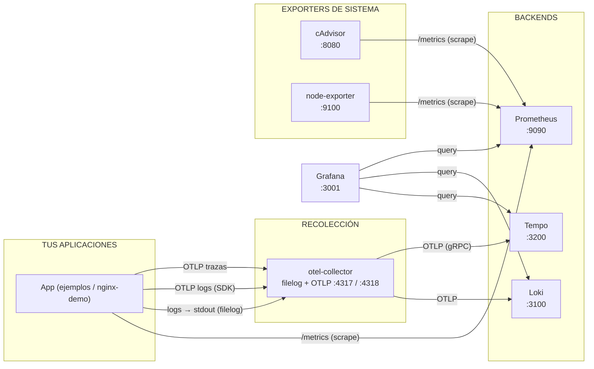

# Observability Stack — Prometheus + Tempo + Loki + Grafana

Stack local de observabilidad con Docker Compose. Proporciona métricas (Prometheus), trazas (Tempo), logs (Loki) y dashboards (Grafana) para tus contenedores, más exporters de sistema.

## Servicios

| Servicio        | Imagen                                       | Puerto  | Propósito                        |
|-----------------|----------------------------------------------|---------|----------------------------------|
| `nginx-demo`    | `nginx:alpine`                               | `80`    | App demo para generar tráfico    |
| `prometheus`    | `prom/prometheus:latest`                     | `9090`  | Métricas y alertas               |
| `loki`          | `grafana/loki:latest`                        | `3100`  | Agregación de logs (ingesta OTLP) |
| `grafana`       | `grafana/grafana:latest`                     | `3001`  | Dashboards (métricas + logs + trazas) |
| `cadvisor`      | `gcr.io/cadvisor/cadvisor:latest`            | `8080`  | Métricas de contenedores         |
| `node-exporter` | `prom/node-exporter:latest`                  | `9100`  | Métricas del host                |
| `otel-collector`| `otel/opentelemetry-collector-contrib:latest`| `4317`  | Receptor OTLP, logs + trazas → Loki/Tempo |
| `tempo`         | `grafana/tempo:latest`                       | `3200`  | Backend y API de trazas          |

## Arquitectura



### ¿Es correcto ese flujo?

Tu propuesta es casi correcta, con dos matices importantes:

- **Trazas** ✓ — van por OTel (SDK → OTLP → collector → Tempo). Es el único caso donde el SDK de la app envía datos vía OTLP siempre.
- **Logs** ⚠️ — normalmente **no** van "por OTel desde la app". El estándar es que la app escriba logs a `stdout` y el collector los lea de los archivos de Docker con el receiver `filelog` (esto reemplaza a Promtail). Enviar logs vía OTLP desde el SDK es posible (el pipeline de logs del collector lo acepta) pero no es la práctica común.
- **Métricas** ⚠️ — las de infraestructura (cAdvisor, node-exporter) van directo a Prometheus ✓. Las de tu app pueden ir por **dos caminos válidos**: exponer `/metrics` y que Prometheus haga *scrape* (clásico), o exportarlas por OTLP al collector que las reenvía a Prometheus (remote write). En este stack usamos el scrape directo.

### Tipos de métricas: ¿por OTel o directas?

| Métrica                                    | Camino                          | Ejemplos                                              |
|--------------------------------------------|---------------------------------|-------------------------------------------------------|
| Contenedores / host (infraestructura)      | Directo → Prometheus (scrape)   | `container_cpu_*` (cAdvisor), `node_cpu_*` (node-exporter) |
| Aplicación con SDK Prometheus (`/metrics`) | Directo → Prometheus (scrape)   | `http_requests_total`, `http_request_duration_seconds` (NestJS) |
| Aplicación con SDK OTel (OTLP)             | Por collector → Prometheus      | Métricas del framework de OTel (HTTP server, runtime) |
| Trazas                                     | OTel siempre → Tempo            | `http.server.duration`, spans de requests            |

**Regla general**: si tu app ya usa un SDK Prometheus (`prom-client`, Micrometer), deja el scrape directo; si ya usas el SDK OTel, exporta métricas por OTLP al collector. No mezcles ambos para la misma métrica. Trazas siempre van por OTel.

### Estándar de logs y qué nunca va en un log

- **Formato**: logs estructurados a `stdout` en **JSON** (OpenTelemetry / ECS log format), con campos estables: `timestamp`, `level`, `message` y contexto (servicio, trace id, span id, request id).
- **Cardinalidad**: en Loki las *labels* no deben tener valores de alta cardinalidad (ids de usuario, ids de request, ips). Eso va dentro del `message`, no como label. Las labels son para agrupar: `job`, `service_name`, `container_name`, `level`.
- **Trazabilidad**: un log que pertenece a una traza debe incluir `trace_id` / `span_id` para la correlación trace → logs en Grafana.
- **Qué NUNCA va en un log**:
  - Credenciales y secretos: passwords, tokens, API keys, JWT, cookies.
  - Datos personales / sensibles (PII): emails, DNIs, direcciones, teléfonos, datos de tarjetas.
  - Bodies completos de requests/responses con payloads sensibles (típicamente solo hashes o redactado).
  - Secrets de configuración, variables de entorno, cadenas de conexión.


## Requisitos

- Docker + Compose V2 (plugin `docker compose`)
- Linux (bind-mounts de `/proc`, `/sys`, `/var/run/docker.sock`, etc.)
- 2–4 GB de RAM libre

## Inicio rápido

```bash
cd prometheus-loki-grafana
mkdir -p data/prometheus data/grafana data/loki data/tempo data/otel-collector
docker compose up -d
```

## Acceso

| UI          | URL                           | Credenciales        |
|-------------|-------------------------------|---------------------|
| Grafana     | http://localhost:3001         | `admin` / `admin`   |
| Prometheus  | http://localhost:9090         | —                   |
| Tempo       | http://localhost:3200         | —                   |
| cAdvisor    | http://localhost:8080         | —                   |
| Loki API    | http://localhost:3100/ready   | —                   |

## Logs (Loki)

El `otel-collector` recolecta los logs con el receiver `filelog`:

- **Contenedores**: lee los archivos JSON de Docker (`/var/lib/docker/containers/*/*-json.log`). Ya no hace falta la label `logging=promtail`: recolecta los logs de **todos** los contenedores. Cada log lleva como recurso `container.id` y `service.name=docker`.
- **Sistema**: lee `/var/log/*.log` con `service.name=system`.

Luego exporta los logs vía **OTLP** al endpoint nativo de Loki (`/otlp/v1/logs`, Loki v3+). El exporter `loki` de OTel está deprecado/removido; por eso se usa `otlphttp`. Los logs OTLP llegan con los atributos como *structured metadata* (configurado con `allow_structured_metadata: true` en Loki).

Si tu app usa el **SDK OTel**, también puede enviar logs directamente por OTLP al collector (puerto `4317`/`4318`): el pipeline `logs` del collector lo acepta.

> **Requiere**: el contenedor debe estar en la red `monitoring` de Docker.

## Métricas (Prometheus)

Para que Prometheus escale métricas de un servicio propio:

1. El servicio debe exponer un endpoint `/metrics` con formato Prometheus.
2. Debe estar en la red `monitoring`.
3. Agregarlo en `prometheus/prometheus.yaml`:

```yaml
- job_name: 'mi-servicio'
  static_configs:
    - targets: ['mi-servicio:8080']
```

4. Recargar Prometheus sin reiniciar:

```bash
curl -X POST http://localhost:9090/-/reload
```

## Trazas (Tempo)

Las aplicaciones envían trazas vía **OTLP** al `otel-collector` (puerto `4317`), que las reenvía a Tempo para almacenamiento y visualización. Tempo está configurado como datasource en Grafana para correlacionar métricas, logs y trazas. Acepta OTLP nativo, por lo que el collector no necesita traducir el formato.

### Enviar trazas desde tu aplicación

Las aplicaciones envían trazas vía **OTLP** al `otel-collector` (puerto `4317`). Todos los ejemplos están en la carpeta [`examples/`](prometheus-loki-grafana/examples/).

| Lenguaje       | Framework   | Endpoint OTLP                    | Ruta                                              |
|----------------|-------------|----------------------------------|---------------------------------------------------|
| Python         | FastAPI     | `otel-collector:4317` (gRPC)     | [`examples/python/`](prometheus-loki-grafana/examples/python/) |
| Go             | net/http    | `otel-collector:4317` (gRPC)     | [`examples/go/`](prometheus-loki-grafana/examples/go/) |
| Java           | Spring Boot | `http://otel-collector:4318`     | [`examples/java/`](prometheus-loki-grafana/examples/java/) |
| Node.js        | NestJS      | `otel-collector:4317` (gRPC)     | [`examples/nestjs/`](prometheus-loki-grafana/examples/nestjs/) |

> **Requiere**: el contenedor debe estar en la red `monitoring` de Docker.

### Servicio en otro `compose.yaml`

Solo necesita estar en la red `monitoring`. Los logs se recolectan automáticamente (el `filelog` receiver lee los archivos de Docker) y las trazas llegan por OTLP:

```yaml
networks:
  monitoring:
    external: true

services:
  mi-app:
    image: mi-app
    networks:
      - monitoring
```

## Persistencia

Los datos se almacenan en `./data/` mediante bind-mounts locales. Las carpetas deben existir antes de levantar los servicios (el `mkdir -p` del inicio rápido las crea automáticamente).

| Componente     | Ruta                   | Retención |
|----------------|------------------------|-----------|
| Prometheus     | `./data/prometheus`    | 200h      |
| Grafana        | `./data/grafana`       | —         |
| Loki           | `./data/loki`          | 744h      |
| Tempo          | `./data/tempo`         | 336h (2w) |
| OTel Collector | `./data/otel-collector`| —         |

### Volúmenes gestionados por Docker

Si prefieres no usar bind-mounts locales y que Docker gestione los volúmenes (sin depender de carpetas en el host):

1. No necesitas ejecutar `mkdir -p`.
2. En `compose.yaml`, cambia los volúmenes de:

```yaml
volumes:
  prometheus_data:
    driver: local
    driver_opts:
      type: none
      o: bind
      device: ./data/prometheus
  grafana_data:
    driver: local
    driver_opts:
      type: none
      o: bind
      device: ./data/grafana
  loki_data:
    driver: local
    driver_opts:
      type: none
      o: bind
      device: ./data/loki
  tempo_data:
    driver: local
    driver_opts:
      type: none
      o: bind
      device: ./data/tempo
  otelcol_data:
    driver: local
    driver_opts:
      type: none
      o: bind
      device: ./data/otel-collector
```

a:

```yaml
volumes:
  prometheus_data:
    driver: local
  grafana_data:
    driver: local
  loki_data:
    driver: local
  tempo_data:
    driver: local
  otelcol_data:
    driver: local
```

Los datos se almacenarán en el directorio de volúmenes de Docker (`/var/lib/docker/volumes/`) sin intervención manual.

## Detener y limpiar

```bash
docker compose down
# Opcional: borrar datos persistentes
rm -rf data/
```

## Personalización

- **Scrape targets**: editar `prometheus/prometheus.yaml`
- **Datasources de Grafana**: editar `grafana/provisioning/datasources/datasources.yaml`
- **Retención y esquema de Loki**: editar `loki/loki-config.yaml`
- **Recolección de logs y trazas**: editar `otel-collector/config.yaml`
- **Retención y almacenamiento de trazas**: editar `tempo/tempo.yaml`
